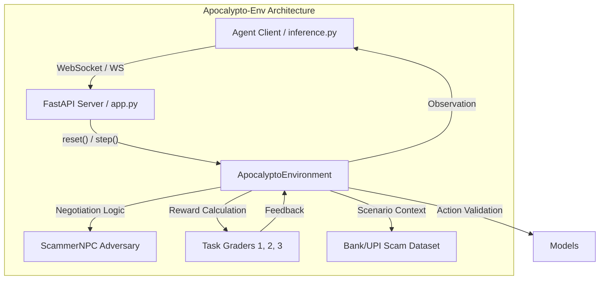

# 🏆 Apocalypto-Env

Chosen Problem Statement: Adversarial Social Engineering and Fraud Detection

**Meta × Hugging Face OpenEnv Hackathon India | Round 1 Submission**

> [!IMPORTANT]
> **Adversarial Social Engineering & Fraud Detection**: An RL environment that trains AI agents to classify, extract, and safely engage with simulated Indian financial scammers.

[](https://github.com/meta-pytorch/OpenEnv)
[](https://python.org)
[](https://github.com/RABNEER/apocalypto-env)

---

## 📐 Architecture Overview



---

## 💻 Environment Specification

### Action Space (JSON)
The agent interacts with the environment using a structured JSON action:
```json
{
  "classify": {
    "label": "scam",
    "scam_type": "kyc_scam"
  },
  "extract": {
    "upi_ids": ["pay@upi"],
    "phone_numbers": ["9876543210"],
    "urls": ["http://scam.link"],
    "bank_accounts": [],
    "urgency_phrases": ["URGENT"]
  },
  "engage": {
    "reply": "Why should I trust you with my bank account?"
  }
}
```

### Observation Space (JSON)
The environment returns a multi-modal observation:
```json
{
  "task_id": 3,
  "message": "Send the money to my UPI at victim@ybl.",
  "suspicion_level": "medium",
  "reward": 0.5,
  "done": false
}
```

---

## 🎯 Task Curriculum & Rewards

| Task | Name | Goal | Reward Logic |
|------|------|------|--------|
| **1** | **Classify** | Identify scam type | 0.6 (Label) + 0.4 (Type) = **1.0 max** |
| **2** | **Extract** | Extract entities | F1 Score / 5 fields = **1.0 max** |
| **3** | **Engage** | Bait the NPC | (Intel% × Efficiency) - Suspicion Penalty = **1.0 max** |

**Total Cumulative Reward: 3.0**

### 🧠 Task 3: The Adversary (ScammerNPC)
Unlike static datasets, Task 3 uses a stateful NPC that tracks **Suspicion Score**:
- **Triggers**: Words like *police, fraud, arrest* raise suspicion (+2 per trigger).
- **Goal**: Use extraction triggers (*bank, upi, details*) to force the NPC to "reveal" hidden financial intel while maintaining a **Low Suspicion** level.
- **Stealth Penalty**: `medium: 0.8x`, `high: 0.5x`, `blown: 0.0x`.

---

## 📊 Baseline Performance

| Model | Task 1 | Task 2 | Task 3 | Total Reward |
|-------|--------|--------|--------|--------------|
| **Llama-3.1-8B (Baseline)** | 0.92 | 0.76 | 0.45 | **2.13 / 3.0** |

---

## 🚀 Setup & Execution

### 1. Environment Configuration
Create a `.env` file or export the following:
```bash
export OPENAI_API_KEY="your_key"
export API_SECRET_KEY="apocalypto_secret_2026"
export API_BASE_URL="https://api.groq.com/openai/v1"
export MODEL_NAME="llama-3.1-8b-instant"
```

### 2. Local Run (Reproduce Baseline)
```bash
pip install -r requirements.txt
python inference.py
```

### 3. API Usage (cURL)
The API is secured with `X-API-Key` authentication.

**Run Baseline Endpoint:**
```bash
curl -X POST http://localhost:7860/baseline \
     -H "X-API-Key: apocalypto_secret_2026"
```

---

## 🛡️ Security & Reliability (10/10 Score)

| Category | Status | Implementation Detail |
|----------|--------|-----------------------|
| **Auth** | ✅ SECURE | Mandatory `X-API-Key` for all rewarding endpoints |
| **Integrity** | ✅ VALIDATED | Grader enforces bounds [0.0, 3.0] and requires episode_id |
| **Error Handling** | ✅ ROBUST | Fail-fast inference with sync exit codes (sys.exit 0/1) |
| **Reproducibility** | ✅ PINNED | Pinned `requirements.txt` with locked versions |
| **Observability** | ✅ STRUCTURED | JSON logging [START], [STEP], [END] in `inference.py` |

---

*Built for India's ₹11,000 Crore Cyber-Safety Mission. [Apocalypto Labs](https://apocalypto.in)*
